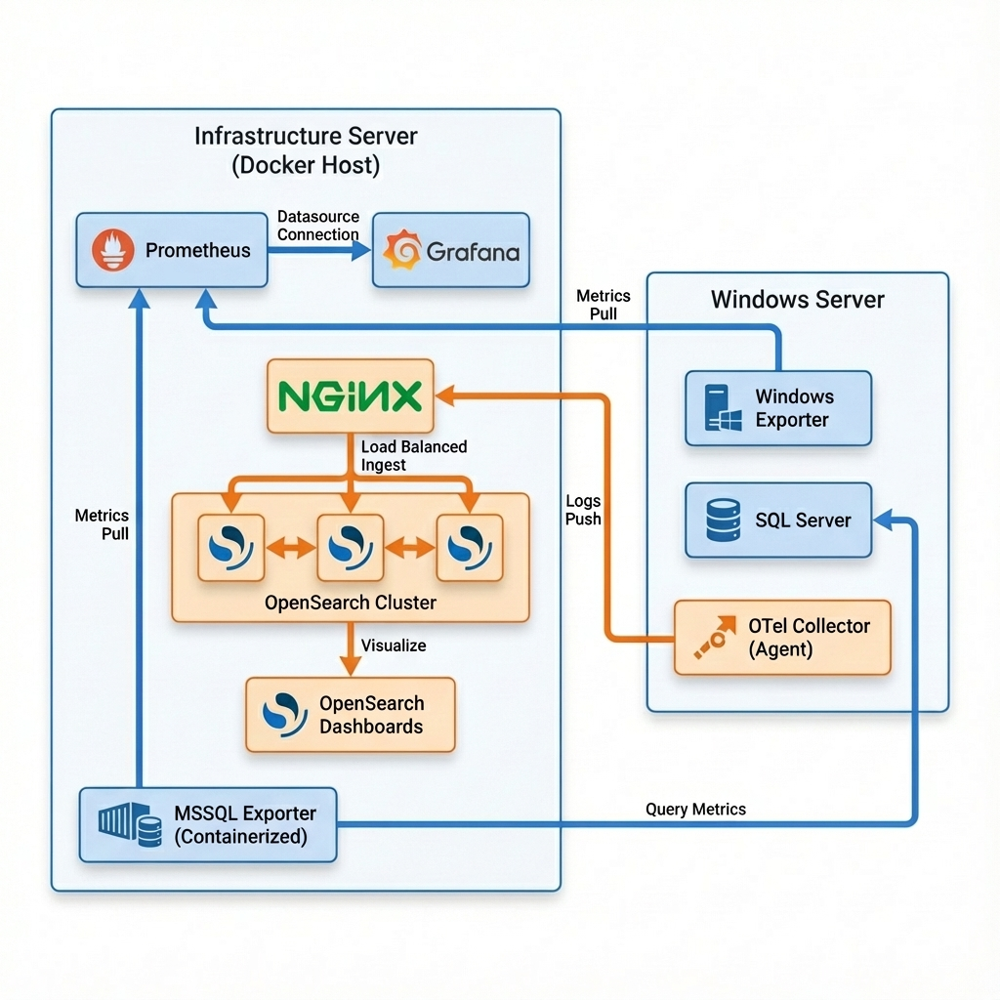
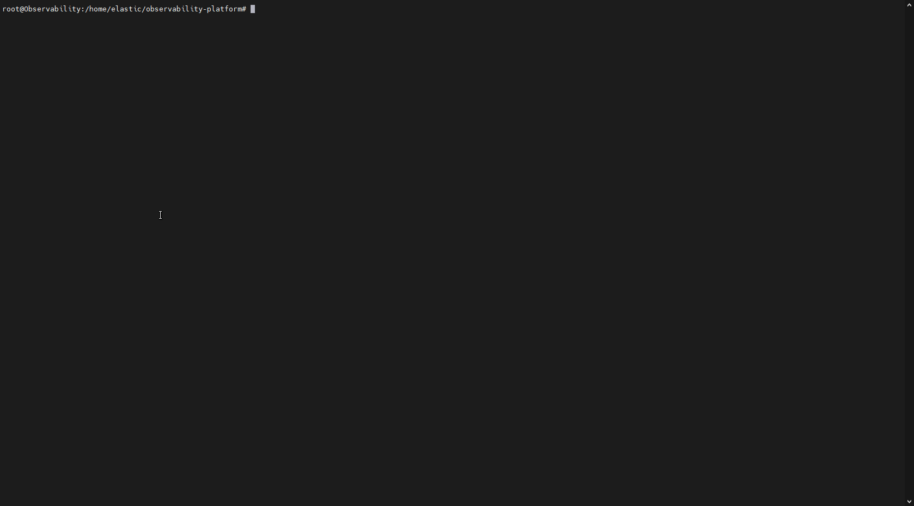
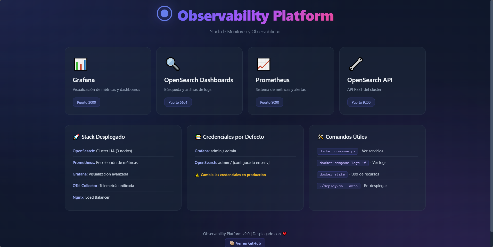

# Stack de Observabilidad para Windows & SQL Server

Este proyecto implementa un stack completo de observabilidad con **Alta Disponibilidad** utilizando contenedores Docker para monitorear aplicaciones Windows, bases de datos SQL Server, y recolectar logs, métricas y trazas distribuidas.

## Arquitectura del Sistema



---

## Quick Start - Despliegue Automatizado

La forma más rápida de desplegar el stack completo es usando el script de despliegue automatizado, el cual te guiará paso a paso a través del despliegue o pasarle los parámetros directamente al script editando el archivo .env

```bash
# 1. Clonar el repositorio
git clone https://github.com/blakpat/observability-platform.git
cd observability-platform

# 2. Dar permisos de ejecución al script
chmod a+x deploy.sh

# 3. Modificar el archivo .env del proyecto
.env 

# 4. Ejecutar el script de despliegue con el .env
./deploy.sh --auto 

# 4.1. Ejecutar el script de despliegue sin el .env
./deploy.sh

```
### Despliegue Automatizado demostración




El script te pedirá interactivamente:
- IP del servidor de infraestructura (donde corre Docker)
- IP del servidor Windows (Windows Exporter + SQL Server)
- Credenciales de SQL Server (host, base de datos, usuario, password)
- Password del admin de OpenSearch
- Configuración SMTP (opcional, para alertas de Grafana)

Una vez completado, el script:
1. Guardará la configuración en un archivo `.env`
2. Aplicará automáticamente los valores a todos los archivos de configuración
### Servicios Principales

| Componente | Versión | Puerto(s) | Función |
|------------|---------|-----------|---------|
| **Grafana** | 11.1.0 | 3000 | Visualización de métricas y dashboards |
| **Prometheus** | 2.54.0 | 9090 | Recolección y almacenamiento de métricas (retención 30d/10GB) |
| **Nginx Load Balancer** | latest | 9200 | Balanceador de carga para OpenSearch (Alta Disponibilidad) |
| **OpenSearch Node 1** | 2.13.0 | 9201, 9300 | Nodo 1 del cluster de búsqueda y almacenamiento de logs |
| **OpenSearch Node 2** | 2.13.0 | 9202, 9301 | Nodo 2 del cluster de búsqueda y almacenamiento de logs |
| **OpenSearch Node 3** | 2.13.0 | 9203, 9302 | Nodo 3 del cluster de búsqueda y almacenamiento de logs |
| **OpenSearch Dashboards** | 2.13.0 | 5601 | Interfaz para búsqueda y visualización de logs |
| **MSSQL Exporter** | latest | 4000 | Exportador de métricas de SQL Server |
| **OTel Collector** | 0.101.0 | 8888/8889 | Recolector de telemetría (logs/traces) |

### Servicios Inactivos

| Componente | Versión | Puerto | Estado |
|------------|---------|--------|--------|
| **AlertManager** | latest | 9093 | ⚠️ **COMENTADO** - Gestión de alertas |
| **Jaeger** | 1.57 | 16686 | ⚠️ **DESHABILITADO** - Tracing distribuido |

---

## 🏠 Landing Page - Punto de Entrada Único

El stack incluye una **landing page moderna** que sirve como punto de entrada centralizado.

### Acceso

```
http://<IP_SERVIDOR_INFRA>:8080
```



## Alta Disponibilidad (HA)

El stack está configurado con **Alta Disponibilidad** mediante:

### Cluster OpenSearch de 3 Nodos
- **Tolerancia a fallos**: Puede sobrevivir a la pérdida de 1 nodo sin perder servicio
- **Quorum**: Con 3 nodos, el cluster mantiene quorum con 2 nodos activos (2/3 = mayoría)
- **Réplicas automáticas**: Los datos se replican entre nodos para redundancia
- **Failover automático**: Si un nodo cae, el cluster se reorganiza automáticamente

### Nginx Load Balancer
- **Distribución de carga**: Reparte el tráfico automáticamente entre los 3 nodos
- **Health checks**: Detecta nodos caídos y deja de enviarles tráfico
- **Punto único de acceso**: Puerto 9200 para todas las conexiones (OTel, Dashboards, APIs)

### Verificación del Cluster

```bash
# Ver salud del cluster
curl http://localhost:9200/_cluster/health?pretty

# Respuesta esperada:
{
  "cluster_name" : "observability-cluster",
  "status" : "green",  # ✅ Green = Cluster saludable
  "number_of_nodes" : 3,
  "active_primary_shards" : X,
  "active_shards" : Y
}

# Ver nodos activos
curl http://localhost:9200/_cat/nodes?v
```
### Demostración


### Prueba de Failover

```bash
# Simular fallo de un nodo
docker stop opensearch-node1

# El cluster sigue funcionando (status: yellow)
curl http://localhost:9200/_cluster/health?pretty

# Restaurar el nodo
docker start opensearch-node1

# El cluster vuelve a green automáticamente
```

---

## Guía de Instalación y Configuración

### **Prerrequisitos**

#### **Servidor de Infraestructura (Docker Host)**
- Sistema Operativo: Linux/Windows con soporte Docker
- Docker Engine 20.10+
- Docker Compose 2.0+
- Mínimo 4GB RAM disponible (recomendado 8GB para el cluster de 3 nodos)
- 30GB de espacio en disco
- Acceso de red al Servidor Windows

#### **Servidor Windows**
- Windows Server 2016+ o Windows 10+
- SQL Server (cualquier edición)
- Acceso de red desde el Servidor de Infraestructura
- Permisos de administrador para instalación

---

## Paso 1: Preparación del Servidor de Infraestructura

### 1.1 Clonar o copiar el proyecto

```bash
# Ubicar el proyecto en el directorio deseado
cd /ruta/del/proyecto/observability-platform
```

### 1.2 Estructura de archivos requerida

```
observability-platform/
├── docker-compose.yml          # Orquestación de todos los servicios
├── nginx.conf                  # Configuración del Load Balancer
├── prometheus.yml              # Configuración de scraping Prometheus
├── collector.yaml              # Configuración del OTel Collector (Docker)
├── custom.ini                  # Configuración SMTP de Grafana
├── Endpoints/
│   ├── otel-config.yaml        # Configuración OTel para Windows
│   └── windows_exporter-0.31.3-amd64.msi
└── Grafana/
    ├── dashboard_main_sw.json
    └── Microsoft SQL Server.json
```

### 1.3 Configurar credenciales sensibles

Edita el archivo `custom.ini` para configurar notificaciones por email:

```ini
[smtp]
enabled = true
host = smtp.tu-proveedor.com:587
user = tu-usuario
password = tu-password
from_address = notifications@tu-dominio.com
from_name = Alertas Observabilidad
```

### 1.4 Configurar endpoints en Prometheus

Edita `prometheus.yml` y actualiza la IP del servidor Windows:

```yaml
scrape_configs:
  - job_name: 'windows'
    static_configs:
      - targets: ['change_me:9182']  # ⬅️ Cambiar por IP del servidor Windows
```

### 1.5 Configurar conexión a SQL Server

Edita `docker-compose.yml` en la sección de `mssql-exporter`:

```yaml
mssql-exporter:
  environment:
    - SERVER=change_me              # ⬅️ IP del servidor Windows
    - USERNAME=mssql_exporter       # ⬅️ Usuario con permisos
    - PASSWORD=change_me            # ⬅️ Contraseña
    - DATABASE=change_me            # ⬅️ Base de datos a monitorear
```

### 1.6 Configurar OTel Collector para Windows

Edita `Endpoints/otel-config.yaml` y actualiza el endpoint de OpenSearch:

```yaml
exporters:
  opensearch:
    logs_index: "windows-app-logs-sw"
    http:
      endpoint: "http://change_me:9200"  # ⬅️ IP del servidor de infraestructura
```

### 1.7 Levantar el stack de observabilidad

```bash
# Iniciar todos los servicios
docker-compose up -d

# Verificar que los contenedores estén corriendo
docker-compose ps

# Verificar salud del cluster OpenSearch
curl http://localhost:9200/_cluster/health?pretty

# Ver logs en tiempo real
docker-compose logs -f
```

### 1.8 Verificar servicios activos

Accede a las siguientes URLs desde tu navegador:

- **Grafana**: http://IP_SERVIDOR_INFRA:3000
  - Usuario por defecto: `admin`
  - Contraseña por defecto: `admin` (cambiar al primer acceso)

- **Prometheus**: http://IP_SERVIDOR_INFRA:9090
- **OpenSearch Dashboards**: http://IP_SERVIDOR_INFRA:5601
- **OpenSearch API (Nginx LB)**: http://IP_SERVIDOR_INFRA:9200
- **OpenSearch Node 1**: http://IP_SERVIDOR_INFRA:9201
- **OpenSearch Node 2**: http://IP_SERVIDOR_INFRA:9202
- **OpenSearch Node 3**: http://IP_SERVIDOR_INFRA:9203

---

## 🪟 Paso 2: Configuración del Servidor Windows

### 2.1 Instalar Windows Exporter

**Windows Exporter** recolecta métricas del sistema Windows y las expone para Prometheus.

1. **Descargar el instalador**:
   - Ubicado en: `Endpoints/windows_exporter-0.31.3-amd64.msi`
   - O descarga la última versión desde: https://github.com/prometheus-community/windows_exporter/releases

2. **Ejecutar el instalador**:
   ```cmd
   # Como administrador
   msiexec /i windows_exporter-0.31.3-amd64.msi
   ```

3. **Verificar instalación**:
   ```powershell
   # Verificar que el servicio esté corriendo
   Get-Service -Name "windows_exporter"
   
   # Verificar que exponga métricas
   Invoke-WebRequest -Uri http://localhost:9182/metrics
   ```

4. **Configurar firewall**:
   ```powershell
   # Permitir conexiones desde el servidor de infraestructura
   New-NetFirewallRule -DisplayName "Windows Exporter" `
     -Direction Inbound `
     -LocalPort 9182 `
     -Protocol TCP `
     -Action Allow
   ```

### 2.2 Configurar SQL Server para monitoreo

1. **Crear usuario de monitoreo en SQL Server**:
   ```sql
   USE [master]
   GO
   
   -- Crear login
   CREATE LOGIN [mssql_exporter] WITH PASSWORD = 'TuPasswordSeguro123!'
   GO
   
   -- Otorgar permisos de lectura
   GRANT VIEW SERVER STATE TO [mssql_exporter]
   GRANT VIEW ANY DEFINITION TO [mssql_exporter]
   GO
   
   -- Permisos en base de datos específica
   USE [tu_base_datos]
   GO
   CREATE USER [mssql_exporter] FOR LOGIN [mssql_exporter]
   ALTER ROLE [db_datareader] ADD MEMBER [mssql_exporter]
   GO
   ```

2. **Configurar firewall para SQL Server**:
   ```powershell
   New-NetFirewallRule -DisplayName "SQL Server" `
     -Direction Inbound `
     -LocalPort 1433 `
     -Protocol TCP `
     -Action Allow
   ```

### 2.3 Instalar OTel Collector en Windows

Si deseas enviar logs y trazas desde aplicaciones Windows:

1. **Descargar OpenTelemetry Collector**:
   ```powershell
   # Desde https://github.com/open-telemetry/opentelemetry-collector-releases/releases
   # Extraer en: C:\Program Files (x86)\OpenTelemetry Collector
   ```

2. **Copiar archivo de configuración**:
   ```powershell
   # Copiar Endpoints/otel-config.yaml a:
   Copy-Item "otel-config.yaml" "C:\ProgramData\otel-config.yaml"
   ```

3. **Editar la configuración** (`C:\ProgramData\otel-config.yaml`):
   - Actualiza `endpoint` con la IP del servidor de infraestructura
   - Configura las rutas de logs a monitorear

4. **Iniciar el servicio**:
   ```cmd
   cd "C:\Program Files (x86)\OpenTelemetry Collector"
   .\otelcol-contrib.exe --config="C:\ProgramData\otel-config.yaml"
   ```

---

### Demostración OTel Collector


## Paso 3: Verificación del Sistema

### 3.1 Verificar recolección de métricas en Prometheus

1. Accede a Prometheus: http://IP_SERVIDOR_INFRA:9090
2. Ve a **Status > Targets**
3. Verifica que aparezcan:
   - `windows` (Estado: UP)
   - `mssql_exporter` (Estado: UP)

### 3.2 Verificar dashboards en Grafana

1. Accede a Grafana: http://IP_SERVIDOR_INFRA:3000
2. **Configurar datasource de Prometheus**:
   - Menu > Connections > Data sources > Add data source
   - Selecciona Prometheus
   - URL: `http://prometheus:9090`
   - Click en "Save & test"

3. **Importar dashboards**:
   - Menu > Dashboards > Import
   - Carga los archivos JSON de la carpeta `Grafana/`
   - Selecciona el datasource de Prometheus configurado

### 3.3 Verificar logs en OpenSearch

1. Accede a OpenSearch Dashboards: http://IP_SERVIDOR_INFRA:5601
2. Ve a **Stack Management > Index Patterns**
3. Crea un index pattern: `windows-index-1`
4. Selecciona el campo de tiempo: `observedTimestamp`
5. Ve a **Discover** y verifica que lleguen logs

### 3.4 Verificar cluster OpenSearch

```bash
# Ver salud del cluster
curl http://localhost:9200/_cluster/health?pretty

# Ver nodos activos (deberían aparecer 3)
curl http://localhost:9200/_cat/nodes?v

# Ver índices y su distribución
curl http://localhost:9200/_cat/indices?v
```

---

## 🔧 Configuraciones Adicionales

### Retención de Datos

**Prometheus** está configurado con:
- Retención por tiempo: **30 días**
- Retención por tamaño: **10GB**
- Datos persistentes en volumen Docker: `prometheus_data`

**OpenSearch**:
- Datos persistentes en volúmenes: `opensearch_data1`, `opensearch_data2`, `opensearch_data3`
- Configurar retención automática con ISM Policies (Index State Management)

### Políticas de Reinicio

Todos los servicios tienen configurado `restart: unless-stopped` para reinicio automático en caso de fallos.

### Redes

Todos los servicios están en la red `observability` para comunicación interna.

### Recursos del Cluster OpenSearch

Cada nodo OpenSearch está configurado con:
- **Memoria JVM**: 512MB (`-Xms512m -Xmx512m`)
- **Total cluster**: ~1.5GB RAM para OpenSearch
- **Escalable**: Puedes añadir más nodos editando `docker-compose.yml`

---

## Componentes Inactivos

### AlertManager (Puerto 9093)
**Estado**: ⚠️ **COMENTADO EN DOCKER-COMPOSE**

Para activarlo:
1. Descomentar la sección en `docker-compose.yml`
2. Crear archivo `alertmanager.yml` con configuración
3. Configurar reglas de alertas en Prometheus
4. Reiniciar servicios: `docker-compose up -d`

### Jaeger (Puerto 16686)
**Estado**: ⚠️ **DESHABILITADO**

Para activarlo:
1. Descomentar la sección de Jaeger en `docker-compose.yml`
2. Actualizar `collector.yaml` para habilitar exportación a Jaeger
3. Reiniciar servicios: `docker-compose up -d`

---

##  Troubleshooting

### Problema: No se reciben métricas de Windows

**Solución**:
```powershell
# En el servidor Windows, verificar:
# 1. Servicio corriendo
Get-Service windows_exporter

# 2. Puerto accesible localmente
Test-NetConnection -ComputerName localhost -Port 9182

# 3. Firewall permite conexión desde servidor infra
Test-NetConnection -ComputerName IP_SERVIDOR_INFRA -Port 9182
```

### Problema: MSSQL Exporter no conecta

**Solución**:
```bash
# Ver logs del contenedor
docker-compose logs mssql-exporter

# Verificar conexión desde el contenedor
docker exec -it mssql-exporter ping IP_SERVIDOR_WINDOWS

# Verificar credenciales SQL
docker-compose restart mssql-exporter
```

### Problema: Cluster OpenSearch en Yellow

**Causas comunes**:
- Disco lleno (>85% uso)
- Nodo caído
- Shards sin asignar

**Solución**:
```bash
# Ver motivo de shards no asignados
curl "http://localhost:9200/_cluster/allocation/explain?pretty"

# Ver uso de disco
df -h

# Forzar reasignación de shards
curl -X POST "http://localhost:9200/_cluster/reroute?retry_failed=true"

# Ajustar réplicas si es necesario
curl -X PUT "localhost:9200/_all/_settings" -H 'Content-Type: application/json' -d'
{
  "index": {
    "number_of_replicas": 1
  }
}'
```

### Problema: Nginx no balancea correctamente

**Solución**:
```bash
# Ver logs de Nginx
docker logs nginx-lb

# Verificar que los nodos respondan
curl http://localhost:9201
curl http://localhost:9202
curl http://localhost:9203

# Reiniciar Nginx
docker-compose restart nginx-lb
```

### Problema: Contenedores no inician

**Solución**:
```bash
# Ver logs detallados
docker-compose logs

# Verificar recursos del sistema
docker system df

# Limpiar recursos no utilizados
docker system prune -a

# Reiniciar servicios
docker-compose down
docker-compose up -d
```

---

##  Puertos Utilizados

### Servidor de Infraestructura

| Puerto | Servicio | Descripción |
|--------|----------|-------------|
| **8080** | **Landing Page** | **Punto de entrada web único** |
| 3000 | Grafana | Interfaz web de visualización |
| 9090 | Prometheus | Interfaz web y API |
| **9200** | **Nginx Load Balancer** | **Punto de acceso único a OpenSearch** |
| 9201 | OpenSearch Node 1 | API REST del nodo 1 |
| 9202 | OpenSearch Node 2 | API REST del nodo 2 |
| 9203 | OpenSearch Node 3 | API REST del nodo 3 |
| 9300-9302 | OpenSearch Transport | Comunicación interna del cluster |
| 5601 | OpenSearch Dashboards | Interfaz web de logs |
| 4000 | MSSQL Exporter | Métricas de SQL Server |
| 8888/8889 | OTel Collector | Recepción de telemetría |
| 9093 | AlertManager | ⚠️ Inactivo |

### Servidor Windows 

| Puerto | Servicio | Descripción |
|--------|----------|-------------|
| 9182 | Windows Exporter | Métricas del sistema Windows |
| 1433 | SQL Server | Base de datos |

---

## Comandos Útiles

### Gestión del Stack

```bash
# Iniciar servicios
docker-compose up -d

# Detener servicios
docker-compose down

# Ver logs en vivo
docker-compose logs -f [servicio]

# Reiniciar un servicio específico
docker-compose restart [servicio]

# Ver estado de servicios
docker-compose ps

# Actualizar servicios tras cambio de configuración
docker-compose up -d --force-recreate

# Ver recursos utilizados
docker stats
```

### Gestión del Cluster OpenSearch

```bash
# Ver salud del cluster
curl http://localhost:9200/_cluster/health?pretty

# Ver nodos del cluster
curl http://localhost:9200/_cat/nodes?v

# Ver índices
curl http://localhost:9200/_cat/indices?v

# Ver shards
curl http://localhost:9200/_cat/shards?v

# Ver configuración del cluster
curl http://localhost:9200/_cluster/settings?pretty

# Borrar índice antiguo
curl -X DELETE "http://localhost:9200/nombre-indice"

# Borrar logs antiguos (más de 7 días)
curl -X POST "http://localhost:9200/windows-app-logs-sw/_delete_by_query" -H 'Content-Type: application/json' -d'
{
  "query": {
    "range": {
      "@timestamp": {
        "lt": "now-7d"
      }
    }
  }
}'
```

---

## Recursos Adicionales

- **Prometheus**: https://prometheus.io/docs/
- **Grafana**: https://grafana.com/docs/
- **OpenSearch**: https://opensearch.org/docs/
- **OpenTelemetry**: https://opentelemetry.io/docs/
- **Windows Exporter**: https://github.com/prometheus-community/windows_exporter
- **MSSQL Exporter**: https://github.com/awaragi/prometheus-mssql-exporter
- **Nginx**: https://nginx.org/en/docs/

---

## Contribuciones

Este proyecto es de código abierto. Las contribuciones son bienvenidas.
